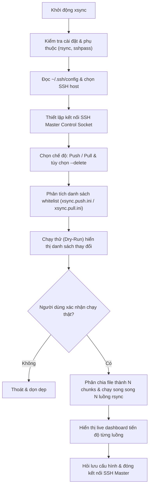

# Cơ chế hoạt động và kiến trúc dự án xsync (Golang)

Tài liệu này giải thích chi tiết về kiến trúc tổng quan, vai trò từng package, luồng xử lý và các kỹ thuật tối ưu hóa trong công cụ `xsync` (phiên bản Go).

---

## 1. Tổng quan dự án

`xsync` là công cụ dòng lệnh (CLI / TUI) hiệu năng cao viết bằng **Go (Golang)**, đóng vai trò như một lớp điều phối và tối ưu hóa cấp cao cho `rsync` và `OpenSSH`. 

Mục tiêu chính của công cụ là tự động hóa việc đồng bộ dữ liệu hai chiều giữa máy cục bộ (local) và máy chủ từ xa (remote server) với tốc độ cao, hỗ trợ lọc danh sách trắng (whitelist), tái sử dụng phiên kết nối SSH và phân luồng đồng bộ song song đa tiến trình (parallel multi-process rsync) kèm giao diện theo dõi thời gian thực.

---

## 2. Kiến trúc tổng thể và cấu trúc package

Cấu trúc mã nguồn Go của dự án được tổ chức chuẩn theo mô hình standard Go project layout:

```
xsync/
├── cmd/
│   └── xsync/
│       └── main.go          # Entry point chính của ứng dụng CLI
├── internal/
│   ├── config/              # Package đọc ~/.ssh/config và quản lý xsync.ini
│   ├── pathutils/           # Package chuẩn hóa đường dẫn và sinh rsync filter
│   ├── sync/                # Package quản lý SSH Master socket và Dry-run
│   ├── parallel/            # Package điều phối truyền tải song song & live dashboard
│   └── tui/                 # Package giao diện dòng lệnh, màu sắc ANSI, menu & editor
├── bin/
│   └── xsync                # Single static binary sau khi biên dịch
├── docs/
│   └── co_che_hoat_dong.md  # Tài liệu kiến trúc và cơ chế
├── Makefile                 # Script build, install, test tự động
├── go.mod                   # Định nghĩa module Go
└── go.sum
```

### Chi tiết các package:

*   [`cmd/xsync/main.go`](file:///mnt/181EC3061EC2DBBE/DT/Code/PJ/xsync/cmd/xsync/main.go): Điểm nhập chính (entry point) của chương trình. Điều phối luồng làm việc, tự động di trú file cấu hình cũ, bắt tín hiệu ngắt (signal interrupt) và dọn dẹp tài nguyên an toàn khi thoát.
*   [`internal/config/config.go`](file:///mnt/181EC3061EC2DBBE/DT/Code/PJ/xsync/internal/config/config.go): Phân tích file `~/.ssh/config` để trích xuất danh sách SSH host, tìm kiếm file cấu hình gần nhất (`FindConfigNearest`), đọc và ghi cấu hình profile máy chủ (`LoadProfiles`, `SaveProfile`).
*   [`internal/pathutils/pathutils.go`](file:///mnt/181EC3061EC2DBBE/DT/Code/PJ/xsync/internal/pathutils/pathutils.go): Chuẩn hóa đường dẫn tương đối/tuyệt đối từ input người dùng và chuyển đổi danh sách whitelist thành các quy tắc `rsync merge filter` (`BuildIncludeFilter`).
*   [`internal/sync/sync.go`](file:///mnt/181EC3061EC2DBBE/DT/Code/PJ/xsync/internal/sync/sync.go): Kiểm tra phụ thuộc hệ thống (`rsync`, `sshpass`), thiết lập kết nối SSH Master socket nền (`SetupSSHMaster`), thực hiện chạy thử nghiệm (`RunDryRun`).
*   [`internal/parallel/parallel.go`](file:///mnt/181EC3061EC2DBBE/DT/Code/PJ/xsync/internal/parallel/parallel.go): Trọng tâm xử lý hiệu năng cao: quét danh sách file cần truyền/xóa, chia nhỏ danh sách thành nhiều chunk, kích hoạt song song $N$ tiến trình `rsync` và cập nhật giao diện tiến độ realtime trên terminal bằng Goroutines.
*   [`internal/tui/tui.go`](file:///mnt/181EC3061EC2DBBE/DT/Code/PJ/xsync/internal/tui/tui.go): Cung cấp các thành phần giao diện dòng lệnh: bảng màu ANSI, menu lựa chọn bằng số, checklist nhiều mục và tích hợp mở trình soạn thảo (`nano`, `vim`) khi cần nhập danh sách tệp.

---

## 3. Luồng hoạt động chi tiết (workflow)

Toàn bộ quy trình thực thi của công cụ diễn ra qua các bước tuần tự:



### Bước 1: Khởi động và kiểm tra môi trường
*   Kiểm tra sự hiện diện của `rsync` và `sshpass` trong hệ thống.
*   Tự động phát hiện và di trú tên các file cấu hình cũ (nếu có) sang định dạng mới (`xsync.ini`, `xsync.push.ini`, `xsync.pull.ini`).

### Bước 2: Lựa chọn SSH profile và kết nối SSH Master
*   Hàm `ParseSSHHosts` đọc file `~/.ssh/config` để hiển thị menu các host đã cấu hình.
*   Sau khi chọn host, hàm `SetupSSHMaster` khởi tạo một tiến trình SSH chạy nền mở **Unix Domain Socket** tại `/tmp/rsync-ctrl-<host>` với các tham số tối ưu:
    *   `ControlMaster=yes`, `ControlPersist=10m`: Duy trì kết nối socket sẵn sàng trong 10 phút.
    *   `-c aes128-gcm@openssh.com`: Sử dụng thuật toán mã hóa nhẹ, tận dụng tăng tốc phần cứng AES-NI.
    *   `Compression=no`: Tắt nén SSH để giảm tải CPU khi truyền dữ liệu dung lượng lớn.
    *   `IPQoS=throughput`: Thiết lập gói tin ưu tiên thông lượng tối đa.

### Bước 3: Phân tích đường dẫn và tạo bộ lọc danh sách trắng (whitelist)
*   Công cụ tìm kiếm và đọc file whitelist tương ứng (`xsync.push.ini` khi push hoặc `xsync.pull.ini` khi pull).
*   Nếu file chưa tồn tại, giao diện sẽ mở trình soạn thảo (`nano`/`vim`) để người dùng nhập đường dẫn.
*   Hàm `BuildIncludeFilter` sinh danh sách quy tắc filter chuẩn cho `rsync`:
    *   Mở đường dẫn cho tất cả thư mục cha: `+ parent/`, `+ parent/sub/`.
    *   Thêm quy tắc cho đối tượng đích: `+ target/` & `+ target/**` (nếu là thư mục) hoặc `+ target` (nếu là file).
    *   Thêm quy tắc loại trừ tất cả các file còn lại ở cuối: `- *`.

### Bước 4: Chạy thử nghiệm (dry-run)
*   Hàm `RunDryRun` thực thi lệnh `rsync` với cờ `--dry-run` thông qua SSH socket đã mở.
*   Toàn bộ danh sách tệp sẽ được thêm mới, cập nhật hoặc xóa (nếu chọn `--delete`) được hiển thị ra màn hình để người dùng kiểm tra trước khi áp dụng thật.

### Bước 5: Cơ chế đồng bộ song song (parallel sync engine)
1.  **Quét danh sách thay đổi:** Chạy rsync dry-run phân tích ngầm để thu thập danh sách file cần truyền (`filesToTransfer`) và file cần xóa (`filesToDelete`).
2.  **Xử lý xóa trước (pre-deletion):** Nếu tùy chọn `--delete` được kích hoạt:
    *   Chế độ push: Gom nhóm các file cần xóa (chunk 300 files) và thực thi lệnh `rm -rf` từ xa qua SSH channel một lần.
    *   Chế độ pull: Xóa trực tiếp trên máy cục bộ.
3.  **Chia chunk danh sách file:** Chia đều mảng `filesToTransfer` thành $N$ phần (mặc định 4 luồng/worker) và ghi tạm vào các file `_chunk_i.txt`.
4.  **Khởi chạy đa tiến trình song song:**
    *   Khởi tạo $N$ tiến trình `exec.Command("rsync", ...)` với tham số `--files-from=_chunk_i.txt`.
    *   Tất cả $N$ tiến trình cùng chia sẻ một SSH control socket duy nhất, không tốn thời gian xác thực lại nhiều lần.
5.  **Live dashboard:** 
    *   Mỗi tiến trình được gắn với 2 Goroutines đọc stream `StdoutPipe` và `StderrPipe`.
    *   Output `--info=progress2` được parse bằng regex để lấy phần trăm hoàn thành, tốc độ truyền tải và file đang đồng bộ.
    *   Sử dụng mã điều khiển con trỏ ANSI (`\033[NF`, `\033[K`) và `time.Ticker` (200ms) để vẽ lại thanh tiến trình (progress bar) của từng luồng theo thời gian thực trên terminal.

### Bước 6: Hoàn tất và dọn dẹp tài nguyên
*   Nếu người dùng có chỉnh sửa cấu hình trong phiên chạy, hệ thống sẽ hiện checklist hỏi có muốn lưu lại vào `xsync.ini`, `xsync.push.ini` hay `xsync.pull.ini` hay không.
*   Hàm `CleanupSSHMaster` đóng SSH socket bằng lệnh `ssh -O exit` và xóa socket file trong `/tmp`.

---

## 4. Tóm tắt các điểm tối ưu kỹ thuật nổi bật

1.  **Single static binary:** Đóng gói toàn bộ ứng dụng thành 1 file nhị phân duy nhất, khởi động tức thì (<5ms) và không phụ thuộc Python runtime.
2.  **SSH multiplexing:** Tận dụng `ControlMaster` của OpenSSH giúp giảm độ trễ bắt tay kết nối (TCP + SSH handshake) xuống bằng 0 cho tất cả các tiến trình rsync con.
3.  **Phân luồng Goroutines:** Quản lý I/O bất đồng bộ an toàn, mượt mà và tiêu tốn cực ít tài nguyên RAM/CPU.
4.  **Bộ lọc danh sách trắng tự động:** Tự động giải quyết cây thư mục cha (`parent directory traversal`) để rsync không bỏ sót đường dẫn khi áp dụng whitelist.
5.  **An toàn dữ liệu:** Luôn có bước dry-run và xác nhận rõ ràng trước khi ghi đè hoặc xóa bất kỳ file nào.
