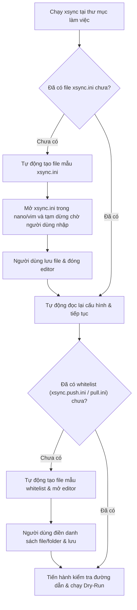

# Các trường hợp xử lý ngoại lệ và lỗi trong xsync

Tài liệu này tổng hợp chi tiết toàn bộ các kịch bản lỗi, mức độ nghiêm trọng, cơ chế xử lý của công cụ `xsync` và hướng dẫn khắc phục cho người dùng.

---

## 1. Nguyên tắc xử lý ngoại lệ

`xsync` tuân thủ nguyên tắc thiết kế phân loại lỗi thành hai nhóm rõ ràng:

1. **Lỗi nghiêm trọng (Fatal Errors):** Các lỗi ảnh hưởng trực tiếp đến an toàn dữ liệu, kết nối mạng, xác thực SSH hoặc tính toàn vẹn cấu hình. Công cụ sẽ **dừng lại ngay lập tức** hoặc **bắt buộc người dùng nhập lại/chỉnh sửa** trước khi được phép tiếp tục.
2. **Cảnh báo có thể bỏ qua (Non-fatal Warnings / Skippable Cases):** Các lỗi do đường dẫn không tồn tại trong danh sách whitelist, danh sách whitelist rỗng hoặc file cấu hình cũ. Công cụ sẽ **thông báo cảnh báo rõ ràng**, **tự động bỏ qua mục lỗi** để không làm gián đoạn việc đồng bộ các dữ liệu hợp lệ khác.

---

## 2. Bảng phân loại lỗi nghiêm trọng (Fatal Errors)

| Trường hợp lỗi | Nguyên nhân | Hành vi của xsync | Hướng xử lý / Khắc phục |
| :--- | :--- | :--- | :--- |
| **Thiếu phụ thuộc hệ thống** | Chưa cài đặt `rsync` hoặc `sshpass` trên máy. | In thông báo lỗi màu đỏ và dừng ngay lập tức. | Chạy lệnh `sudo apt install -y rsync sshpass` (Linux) hoặc `brew install rsync esolitos/ipa/sshpass` (macOS). |
| **Không có SSH Host** | File `~/.ssh/config` chưa được tạo hoặc không có `Host` nào. | Thông báo lỗi, tự động tạo file mẫu và mở trình soạn thảo (`nano`/`vim`) để người dùng khai báo host. | Điền thông tin host trong `~/.ssh/config`, lưu lại và tiếp tục. |
| **Host chưa cấu hình `REMOTE_DIR`** | Section host trong `xsync.ini` chưa có dòng `remote_dir` hoặc để trống. | Hiển thị menu cảnh báo, cho phép mở trực tiếp `xsync.ini` để điền hoặc chọn host khác. | Khai báo đường dẫn thư mục đích trên server (ví dụ: `remote_dir = /home/user/app`). |
| **Sai mật khẩu SSH** | Mật khẩu khai báo trong `xsync.ini` sai hoặc nhập tay không đúng. | Báo lỗi `Authentication failed`, hiển thị menu cho phép nhập lại mật khẩu hoặc mở `xsync.ini` sửa lại. | Nhập đúng mật khẩu hoặc cấu hình SSH Key (`ssh-copy-id`) để không cần mật khẩu. |
| **Không kết nối được SSH Server** | Server tắt nguồn, sai IP, sai port hoặc tường lửa (Firewall) chặn. | Báo lỗi chi tiết từ OpenSSH, hiển thị menu thử lại hoặc dừng lại. | Kiểm tra lại địa chỉ IP, port SSH, VPN hoặc trạng thái của server. |
| **Lỗi quyền truy cập (Permission Denied) khi Dry-Run** | User SSH không có quyền đọc/ghi trên thư mục `REMOTE_DIR` hoặc local. | In lỗi chi tiết từ rsync và dừng chương trình trước khi thực thi thật. | Kiểm tra `chmod` / `chown` của thư mục đích trên server. |
| **Người dùng hủy ngang** | Người dùng nhấn `Ctrl+C` hoặc chọn menu "Dừng lại / Thoát". | Đóng socket SSH Master, xóa file tạm và thoát an toàn với mã `130` hoặc `0`. | Không phát sinh tiến trình chạy ngầm rò rỉ trên hệ thống. |

---

## 3. Bảng phân loại cảnh báo có thể bỏ qua (Non-fatal Warnings)

| Trường hợp | Mô tả | Hành vi của xsync |
| :--- | :--- | :--- |
| **Đường dẫn trong push whitelist không tồn tại** | File `xsync.push.ini` khai báo `folder_a/` nhưng thư mục này không có trên máy local. | Cảnh báo: `[WARN] Duong dan 'folder_a/' khong ton tai o Local, tu dong bo qua.` → Tự động loại bỏ khỏi bộ lọc và vẫn đồng bộ bình thường các đường dẫn hợp lệ khác. |
| **Đường dẫn chứa khoảng trắng, dấu ngoặc kép hoặc gạch chéo ngược** | Người dùng kéo thả file vào terminal làm dính dấu `"`, `'` hoặc `\`. | Tự động chuẩn hóa, bỏ dấu ngoặc kép, chuyển `\` thành `/`, loại bỏ comment `#`. |
| **File whitelist trống rỗng** | `xsync.push.ini` hoặc `xsync.pull.ini` rỗng hoặc toàn dòng ghi chú. | Cảnh báo: `[WARN] Whitelist khong co muc hop le nao.` → Hiển thị menu cho phép: (1) Tiếp tục đồng bộ TOÀN BỘ thư mục, (2) Mở lại file whitelist để nhập, (3) Dừng lại. |
| **Server có file trùng tên với `remote_dir`** | Trên server có file thường trùng tên với thư mục muốn tạo. | Tự động gửi lệnh xóa file trùng tên để nhường chỗ tạo thư mục remote an toàn. |
| **Số lượng file Dry-Run quá lớn (>20 file)** | Có hàng trăm/hàng nghìn file cần đồng bộ. | Tự động rút gọn preview 10 file đầu + 5 file cuối, lưu toàn bộ 100% log vào file `/tmp/xsync_dryrun_<timestamp>.log`. |
| **Tồn tại file cấu hình phiên bản cũ** | Thư mục chứa file `.env_rsync`, `.rsyncinclude.push`. | Tự động di trú (rename) sang định dạng chuẩn `xsync.ini`, `xsync.push.ini`, `xsync.pull.ini`. |

---

## 4. Cơ chế tự động khởi tạo và chỉnh sửa file cấu hình (Auto-init & Interactive Editing)

Khi người dùng chạy lệnh `xsync` tại một thư mục làm việc mới:

*   **Trình soạn thảo mặc định:** Tự động ưu tiên biến môi trường `$EDITOR`, nếu chưa có sẽ tìm `nano`, `vim`, `vi`.
*   **Bảo mật:** Tất cả các file `.ini` được tự động bỏ qua bởi `.gitignore`, đảm bảo không bao giờ bị lộ mật khẩu lên hệ thống Git.
